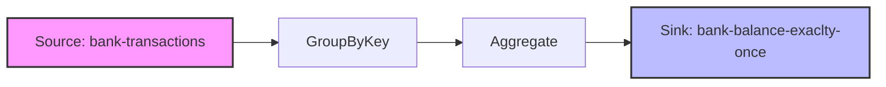

# Bank Balance Application

This application demonstrates the use of Kafka Streams to process bank transactions and calculate real-time account balances with exactly-once processing guarantees.

## Overview

The Bank Balance application consists of two main components:
1. A transaction producer that generates random transactions for different customers
2. A Kafka Streams application that processes these transactions and maintains the current balance for each customer

The application showcases several important Kafka Streams features:
- Stateful processing with KTables
- Exactly-once processing semantics
- JSON serialization/deserialization with Jackson
- Aggregation operations

## Prerequisites

To run this application, you need:
- Java 21 or higher
- Apache Maven 3.6 or higher
- Apache Kafka 3.0 or higher (or a Kafka-compatible service)
- Git (optional, for cloning the repository)

## Running the Application

### Step 1: Start Kafka

Make sure you have a Kafka cluster running. You can use the provided docker-compose file in the `infra` directory:

```bash
cd infra
docker-compose up -d
```

### Step 2: Create the Kafka Topics

Create the required Kafka topics:

```bash
kafka-topics --bootstrap-server localhost:9092 --create --topic bank-transactions --partitions 1 --replication-factor 1
kafka-topics --bootstrap-server localhost:9092 --create --topic bank-balance-exaclty-once --partitions 1 --replication-factor 1
```

### Step 3: Build the Application

Build the application using Maven:

```bash
cd code/bank-balance
mvn clean package
```

### Step 4: Run the Application

Run the application using the generated JAR file:

```bash
java -jar target/bank-balance-1.0-SNAPSHOT.jar
```

The application will start producing random transactions and processing them to calculate account balances.

### Step 5: Monitor the Results

You can monitor the output topic to see the calculated balances:

```bash
kafka-console-consumer --bootstrap-server localhost:9092 --topic bank-balance-exaclty-once --from-beginning
```

## Environment Variables

The application can be configured using the following environment variables:

- `APPLICATION_ID_CONFIG`: The Kafka Streams application ID (default: "bank-balance-app")
- `BOOTSTRAP_SERVERS_CONFIG`: Kafka bootstrap servers (default: "localhost:9092")
- `AUTO_OFFSET_RESET_CONFIG`: Consumer auto offset reset policy (default: "earliest")
- `CACHE_MAX_BYTES_BUFFERING_CONFIG`: Cache size for the state store (default: "0")

## How It Works

### Technical Overview

The Bank Balance application demonstrates a simple yet powerful Kafka Streams topology:

1. **Source**: Reads JSON transactions from the `bank-transactions` topic
2. **GroupByKey**: Groups transactions by customer name
3. **Aggregate**: Maintains a running balance for each customer
4. **Sink**: Writes the updated balances to the `bank-balance-exaclty-once` topic

The application uses exactly-once processing semantics to ensure that each transaction is processed exactly once, even in the case of failures or restarts.

### Transaction Format

Each transaction is a JSON object with the following structure:
```json
{
  "Name": "john",
  "amount": 42,
  "time": "2023-04-21T15:30:45.123Z"
}
```

### Balance Format

The calculated balance is a JSON object with the following structure:
```json
{
  "count": 5,
  "balance": 217,
  "time": "2023-04-21T15:35:12.456Z"
}
```

### Topology Diagram



### Serialization/Deserialization

The application uses custom serializers and deserializers for JSON data:
- `JsonNodeSerializer`: Serializes Jackson JsonNode objects to bytes
- `JsonNodeDeserializer`: Deserializes bytes to Jackson JsonNode objects
- `JsonNodeSerde`: Combines the serializer and deserializer into a Serde for use with Kafka Streams

### Exactly-Once Processing

The application uses Kafka's exactly-once processing guarantees to ensure that:
1. Each transaction is processed exactly once
2. The state store (which maintains the balances) is consistent with the output topic
3. No duplicate or lost transactions occur, even in the case of failures

This is achieved through:
- Transaction producers with idempotence enabled
- Kafka Streams with exactly-once processing configured
- Proper state store management

## Troubleshooting

If you encounter issues:

1. Ensure Kafka is running and accessible
2. Check that the required topics exist
3. Verify that the application has the correct permissions to read from and write to Kafka
4. Check the logs for any error messages

## Further Reading

- [Kafka Streams Documentation](https://kafka.apache.org/documentation/streams/)
- [Exactly-Once Semantics in Kafka](https://www.confluent.io/blog/exactly-once-semantics-are-possible-heres-how-apache-kafka-does-it/)
- [Jackson JSON Processing](https://github.com/FasterXML/jackson)