# **Favourite Colour - Solution v2**

This application is based on the example described [here](https://www.udemy.com/course/kafka-streams/).

## Data flow diagram

```mermaid
graph LR
    subgraph Input Stream
        InputTopic["favourite-colour-input"]
    end

    subgraph Stream Processing
        StreamRead["KStream: textLines"]
        FilterComma["filter: contains ','"]
        SelectUserKey["selectKey: user (lowercase)"]
        MapColour["mapValues: colour (lowercase)"]
        FilterColours["filter: allowed colours (green, red, blue)"]
    end

    subgraph Intermediate Topic
        UserColoursTopic["user-keys-and-colours"]
    end

    subgraph Table Processing
        UserColoursTable["KTable: usersAndColoursTable"]
        GroupByColour["groupBy: colour"]
        CountColours["count occurrences"]
    end

    subgraph Output
        OutputTopic["favourite-colour-output"]
    end

%% Edges representing data flow
    InputTopic --> StreamRead
    StreamRead --> FilterComma --> SelectUserKey --> MapColour --> FilterColours
    FilterColours --> UserColoursTopic
    UserColoursTopic --> UserColoursTable
    UserColoursTable --> GroupByColour --> CountColours
    CountColours --> OutputTopic

```



--- 

## Prerequisites

- **Java 17** installed locally (if you intend to compile the application before creating the image)
- **Maven** installed (to build the project)
- **Docker** installed and running

## Getting started

### Clean and build the project
Use Maven to ensure the project is properly compiled and packaged into a JAR inside the target/ directory. In your terminal:

```bash
mvn clean package
```
### Build the Docker image
After the build step, you should have your JAR file (e.g., app.jar) in the target/ directory. To create the Docker image, run:

```bash
docker build -t favourite-colour-app .
```
- t my-kafka-streams-app sets the name (tag) of the Docker image.
- . indicates that the Dockerfile is in the current directory.

### Run the container

```bash
docker run -d --name favourite-colour-app --network infra_kafka-net favourite-colour-app
```
> This network is used inside the docker-compose.

### Clean up

To stop and remove the container when you're done:

```bash
docker stop favourite-colour-app
docker rm favourite-colour-app
```

> You can test running this app from the IDE and docker to see how Kafka will handle with the consumer group.

---

## Reference

- [Apache Kafka Series - Kafka Streams for Data Processing](https://www.udemy.com/course/kafka-streams)
- [Baeldung - Introduction to KafkaStreams in Java](https://www.baeldung.com/java-kafka-streams)
- [Mastering Kafka Streams and ksqlDB](https://learning.oreilly.com/library/view/mastering-kafka-streams/9781492062486/ch07.html)
- [Kafka Streams Developer Guide for Confluent Platform](https://docs.confluent.io/platform/current/streams/developer-guide/overview.html)