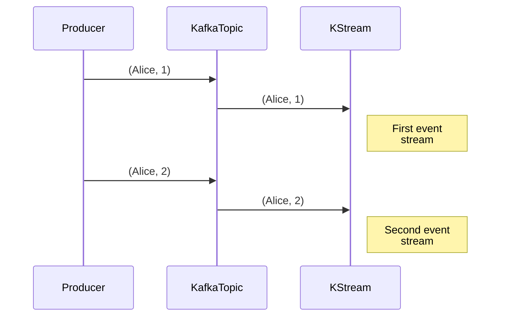
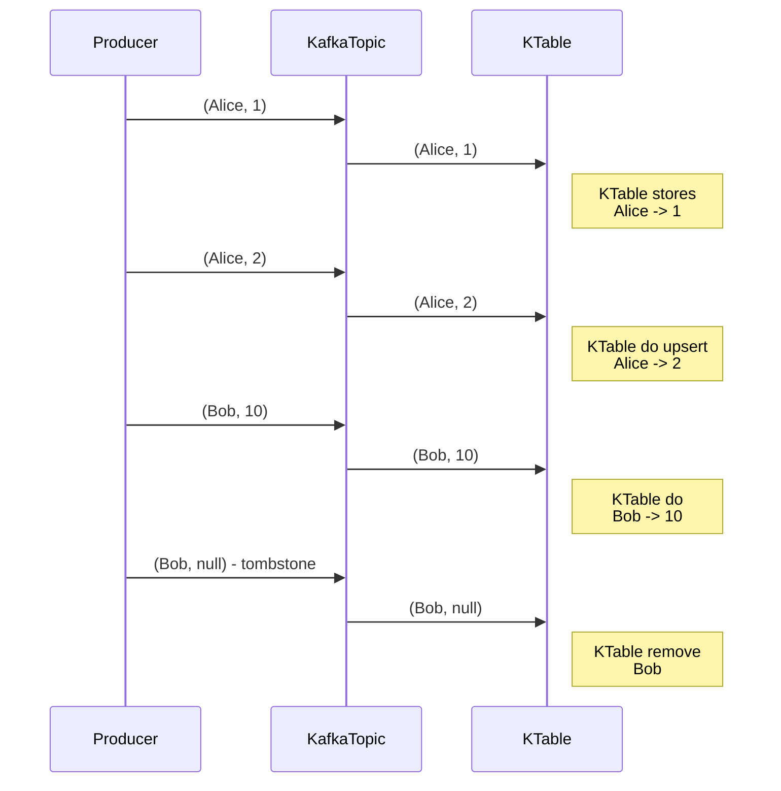

# Kafka Streams Application Terminology


- A `stream` is a sequence of immutable data records, that fully ordered, can be replayed, and is fault tolerant.
- A `stream processor` is a node in the processor topology (graph). It transforms incoming streams, record by record, and may create a new stream from it.
- A `source processor` is a special processor that takes its data directly from a Kafka Topic. It has no predecessors in a topology, and don't transform the data.
- A `sink processor` is a processor that does not have children, it sends the stream data directly to a Kafka topic.

## Topology

In this section, we will see examples of `high level dsl` and the `low level processor api`.

### **High Level DSL**

The High-Level DSL provides an intuitive, fluent API designed for rapid development, ease of use, and readability.

#### Main Characteristics

- High abstraction level: Simplifies common stream-processing operations.
- Expressive and fluent API: Easy to write, read, and maintain.
- Built-in operators: Filtering, mapping, aggregations, joins, windowing.

#### DSL Example

```java
StreamsBuilder builder = new StreamsBuilder();
builder.stream("input-topic")
       .filter((key, value) -> value.contains("important"))
       .mapValues(String::toUpperCase)
       .to("output-topic");
```

#### When to use DSL

- Quick prototyping and development.
- Common scenarios like filtering, transformations, joins, windowing.
- Applications that prioritize readability and ease of maintenance.

### **Low Level Processor API**

The Low-Level Processor API offers granular control over each processing step, explicitly handling state stores, message flow, and time semantics.

#### Main Characteristics

- Low-level, granular control: Direct control over message processing, state stores, and forward operations.
- Explicit state management: Direct interaction with state stores and processors.
- Custom logic: Flexible implementation for advanced scenarios.

#### Processor API Example

```java
Topology topology = new Topology();

topology.addSource("Source", "input-topic")
        .addProcessor("Processor", () -> new MyProcessor(), "Source")
        .addSink("Sink", "output-topic", "Processor");

class MyProcessor implements Processor<String, String> {
    private ProcessorContext context;

    @Override
    public void init(ProcessorContext context) {
        this.context = context;
    }

    @Override
    public void process(String key, String value) {
        if (value.contains("important")) {
            context.forward(key, value.toUpperCase());
        }
    }

    @Override
    public void close() {}
}
```

#### When to use Processor API

- Complex or custom processing logic.
- Direct manipulation of message timestamps and headers.
- Explicit access and management of state stores.
- Advanced integrations or fine-grained optimization.

### Comparison Table

|Aspect|High-Level DSL|Low-Level Processor API|
|------|--------------|-----------------------|
|Complexity|✅ Simple, intuitive| ⚙️ More complex, detailed|
|Level of Control|🟡 Moderate (abstracted control)|✅ High (fine-grained, explicit control)|
|Ease of Use|✅ Easy, rapid development|⚙️ Requires deeper Kafka knowledge|
|State Management|🟡 Abstracted (managed by Kafka Streams)|✅ Explicit, direct access|
|Performance|🟡 Good, but less customizable|✅ Highly customizable, optimized|
|Typical Use Cases|✅ Standard scenarios (filtering, mapping, joins, aggregations)|⚙️ Advanced or custom scenarios|


### Combining Both Approaches

You can combine the DSL and Processor API to leverage the strenghts of both approaches, for example:

```java
StreamsBuilder builder = new StreamsBuilder();

builder.stream("input-topic")
       .process(() -> new MyCustomProcessor())
       .to("output-topic");
```
This allows you to start with the simplicity of the DSL and inject custom processors for specialized requirements.

---

## Internal Topics

- Running a Kafka Streams may eventually create internal intermediary topics.

### Types

- **Repartitioning topics**: in case you start transforming the key of your stream, a repartitioning will happen at some processor.
- **Changelog topics**: in case you perform aggregations, Kafka Streams will save compacted data in these topics

### Observations

- Are managed by Kafka Streams
- Are used by Kafka Streams to save / restore state and repartition data
- Are prefixed by application.id parameter
- Should never be deleted, altered or published to. **They are internal**

> If you list your topics probably will see something like `${application.id}-KSTREAM-AGGREGATE-STATE-STORE-${number}-repartition` and the same name ending with `changelog`.

---

## KStreams and KTables

### **KStream**

KStream treats each message as an event (“change log”). All occurrences of (Alice, 1) and (Alice, 2) are in the stream.



> KStream is recomended when you are reading from a topic that's not compacted.
> If new data is partial information / transactional aswell.


### **KTable**

KTable maintains a current state per key. When it reaches (Alice, 2), it overwrites (Alice, 1). In the end, only (Alice, 2) exists for the key “Alice”. And when it receives a null value, it deletes the record, as in the case of (Bob, null).



> KTable is recommended when you are reading from a topic that's log-compacted(aggregations).
> KTable more if you need a structure that's like a `database table`, where every update is self suficient (like total bank balance)

---