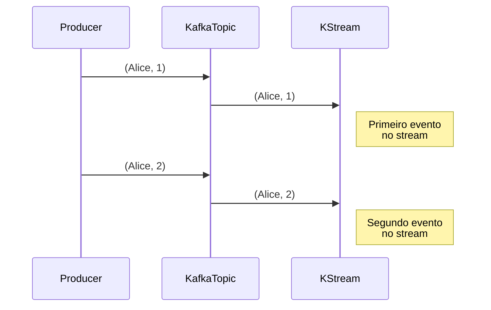
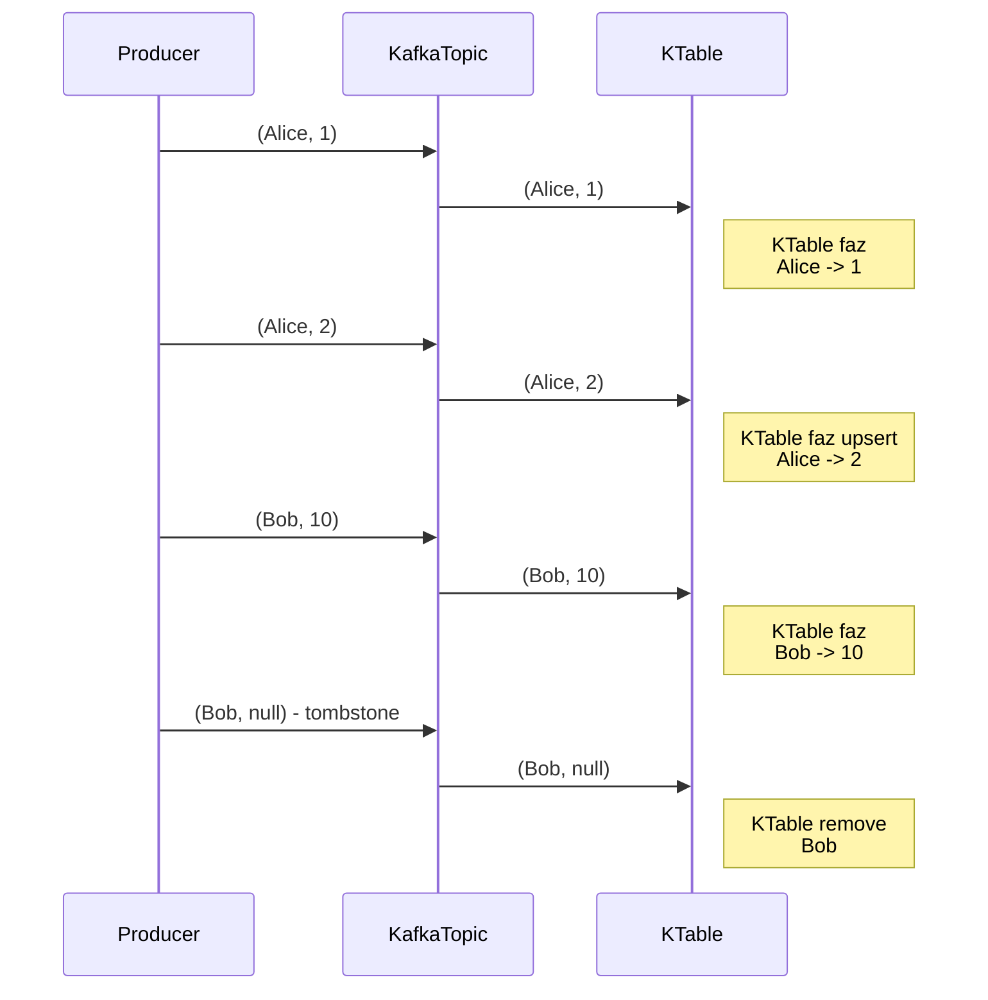

# Kafka Streams Application Terminology

- A `stream` is a sequence of immutable data records, that fully ordered, can be replayed, and is fault tolerant.
- A `stream processor` is a node in the processor topology (graph). It transforms incoming streams, record by record, and may create a new stream from it.
- A `source processor` is a special processor that takes its data directly from a Kafka Topic. It has no predecessors in a topology, and don't transform the data.
- A `sink processor` is a processor that does not have children, it sends the stream data directly to a Kafka topic.

## Topology

In this section, we will see examples of `high level dsl` and the `low level processor api`.

### **High Level DSL**

#TODO

### **Low Level Processor API**

#TODO

---

## Internal Topics

- Running a Kafka Streams may eventually create internal intermediary topics.

### Types

- **Repartitioning topics**: in case you start transforming the key of your stream, a repartitioning will happen at some processor.
- **Changelog topics**: in case you perform aggregations, Kafka Streams will save compacted data in these topics

### Observations

- Are managed by Kafka Streams
- Are used by Kafka Streams to save / restore state and repartition data
- Are prefixed by application.id parameter
- Should ever be deleted, altered or published to. **They are internal**

> If you list your topics probably will see something like `${application.id}-KSTREAM-AGGREGATE-STATE-STORE-${number}-repartition` and the same name ending with `changelog`.

---

## KStreams and KTables

### **KStream**

KStream treats each message as an event (“change log”). All occurrences of (Alice, 1) and (Alice, 2) are in the stream.

### **KTable**

KTable maintains a current state per key. When it reaches (Alice, 2), it overwrites (Alice, 1). In the end, only (Alice, 2) exists for the key “Alice”. And when it receives a null value, it deletes the record, as in the case of (Bob, null).

---