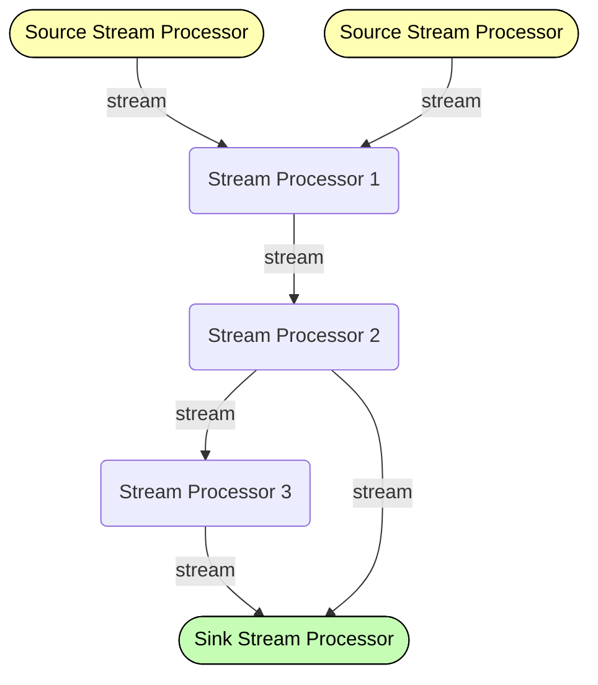

# Kafka Streams Application Terminology

- A `stream` is a sequence of immutable data records, that fully ordered, can be replayed, and is fault tolerant.
- A `stream processor` is a node in the processor topology (graph). It transforms incoming streams, record by record, and may create a new stream from it.
- A `source processor` is a special processor that takes its data directly from a Kafka Topic. It has no predecessors in a topology, and don't transform the data.
- A `sink processor` is a processor that does not have children, it sends the stream data directly to a Kafka topic.

## Topology

In this section, we will see examples of `high level dsl` and the `low level processor api`.

### **High Level DSL**

#TODO

### **Low Level Processor API**

#TODO